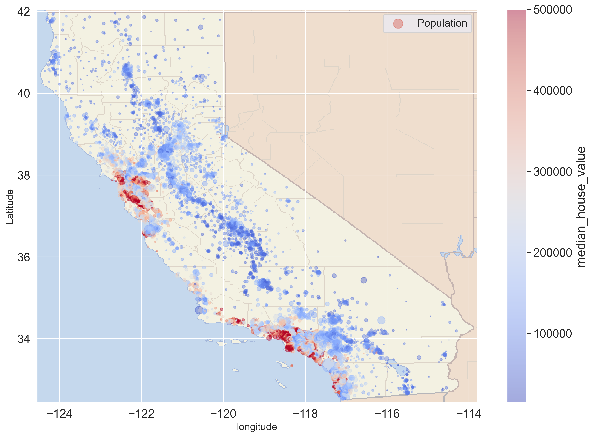
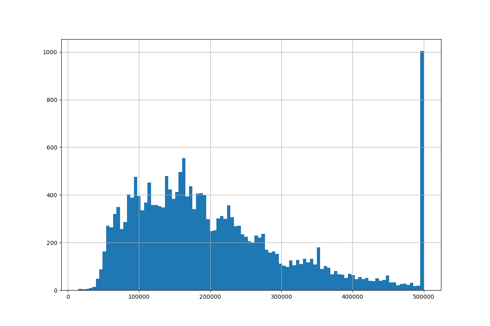

# House Price Prediction Project

## Overview
This repository contains a Python-based data science project aimed at predicting house prices. It involves comprehensive data analysis, preprocessing, exploratory data analysis (EDA), and the application of machine learning techniques.

## Dataset
The project utilizes the `housing.csv` dataset, encompassing various features like geographical coordinates, total rooms, population, and median income. 

## Key Features
- **Data Preprocessing**: Cleaning and preparation of data, with special attention to missing values in `total_bedrooms`.
- **Exploratory Data Analysis (EDA)**: Detailed statistical analysis and visualization to understand housing market trends.
- **Visualization**: In-depth visualization to reveal data patterns and insights.

## Visualizations
  
*California Plot*

  
*Hist of Median House Value*

## Code
The repository includes Python scripts and Jupyter notebooks detailing the entire process, from initial data cleaning to final predictions.

## How to Use
1. Clone the repository.
2. Install required dependencies.
3. Run the Jupyter notebooks for a step-by-step walkthrough.

## Author
- **Fadi Ayoub**

## License
This project is [MIT licensed](https://www.udemy.com/course/the-pandas-bootcamp/).

## Acknowledgements
- Mention any collaborators, data sources, or inspirations.

---

*This README is a brief overview of the project. For detailed analysis and results, please refer to the Jupyter notebooks included in this repository.*
